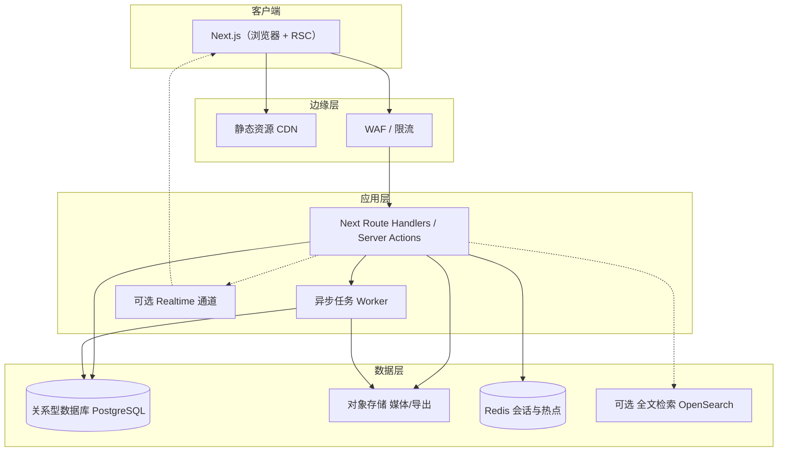
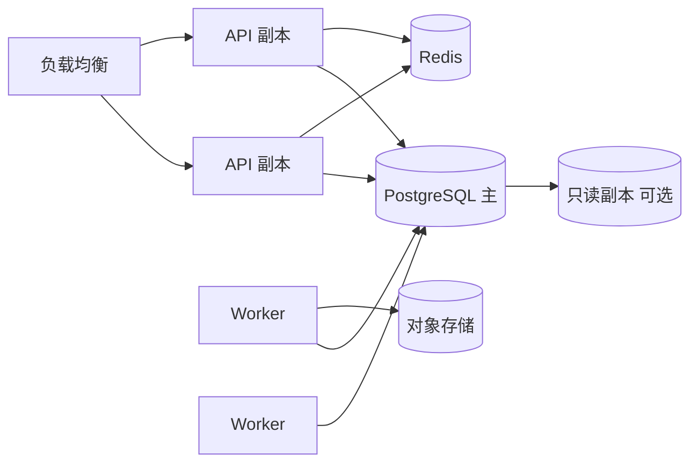

# 系统架构

本文档描述家谱 Web 系统的逻辑架构、物理部署视图、核心数据流与非功能约束。具体表结构见 `03-data-model.md`，API 路径约定见 `04-api-design.md`。

## 1. 架构目标

| 目标 | 说明 |
|------|------|
| 多租户隔离 | 空间（Tenant）之间数据与配置严格隔离。 |
| 可演进 | 领域模型稳定，统计与报表可独立迭代。 |
| 可审计 | 关键写操作留痕；支持谱书快照与恢复点。 |
| 可扩展 | 万级人员规模下树浏览与统计查询可用（依赖索引与异步预聚合策略）。 |

## 2. 高层逻辑架构

### 2.1 组件职责

- **Web SPA**：家谱可视化、表单、统计图表、权限 UI；不持久化业务机密。
- **API 服务**：认证授权、领域校验、事务性写入、查询编排、生成导出任务。
- **异步 Worker**：GEDCOM/大表导入解析、PDF 生成、批量重算统计快照、邮件/Webhook。
- **关系型 DB**：人员、关系、事件、权限、审计、工单、版本快照元数据。
- **对象存储**：媒体原文件、导出文件、大备份包；由 API 签发预签名 URL。
- **Redis**：会话、限流计数、短期统计缓存、分布式锁（导入单空间互斥等）。
- **全文检索（可选）**：人物/传记/别名搜索；无则 PostgreSQL `pg_trgm` / GIN 降级。

## 3. 多租户模型

- **TenantId** 贯穿所有业务表；连接池层或 ORM 层强制 `tenant_id` 过滤（防呆查询封装）。
- 超级运维角色跨租户只读需单独审批流程与审计（默认关闭）。

## 4. 有界上下文（DDD 划分建议）

| 上下文 | 职责 | 对外暴露 |
|--------|------|----------|
| Identity | 用户、会话、MFA、空间成员资格 | JWT / Session 声明含 `tenant_roles` |
| Genealogy | 人员、关系、家庭、事件、地点、字辈 | REST + 领域事件 |
| Media | 文件元数据、存储 key、关联 | REST + 回调 |
| Collaboration | 工单、评论、通知 | REST + 可选 WebSocket |
| Statistics | 指标定义、物化快照、查询 API | 只读 REST |
| Publishing | 谱书版本快照、冻结规则 | REST |
| Admin | 字典、空间配置、用量 | REST |

上下文之间通过 **应用服务编排** 或 **领域事件**（同一进程内可简化为事务后钩子；多服务时用消息队列）同步，避免循环依赖。

## 5. 核心请求路径

### 5.1 读家谱子树

1. 客户端请求 `GET /trees/subtree?rootId=&depth=`（示例，见 API 文档定稿）。
2. API 校验用户对该 `rootId` 子树的 `read` 权限。
3. 从 DB 读取人员与关系边（分页或按层）；敏感字段按策略剥离。
4. 可选：Redis 缓存子树 JSON（键含 `tenant + root + depth + policy_version`）。

### 5.2 写关系（事务边界）

1. `POST` 关系创建 → 校验两端人员可见、无环路（对「亲子」有向边做 DAG 检测）、业务规则（如单亲重复）。
2. 同一事务写入 `relationship` + `audit_log`；发布内部事件 `RelationshipChanged`。
3. Worker 订阅事件：将受影响子树加入 **统计重算队列**（防抖合并同一租户任务）。

### 5.3 统计查询

- **在线聚合**：简单计数、分代直方图可由 SQL 直接算（依赖索引）。
- **重快照**：复杂报表或大数据量时由 Worker 写入 `stats_snapshot` 表，前端读快照 + `computed_at`。
- 所有统计接口必须接受 **筛选器**（房支根、时间窗、存殁等）并返回 `sample_size` 与 `excluded_reasons` 摘要。

## 6. 权限架构

- **认证**：JWT（短期）+ Refresh Token 旋转；或 Session Cookie（HttpOnly）。
- **授权模型**：RBAC + ABAC 混合——角色决定默认能力，**数据范围**（房支/子树）与 **字段策略** 用属性规则解析（见 `05-security-privacy.md`）。
- **强制过滤**：列表与详情在数据库查询层附加权限谓词，禁止仅在前端隐藏。

## 7. 合并人员与冲突处理

- 合并操作为 **异步长事务**：先锁定两人记录 → 生成 `merge_plan` → 人工确认（或工单批准）→ Worker 执行重映射外键 → 软删被并人员 → 审计。
- 并发合并同一人员：数据库唯一约束 + 应用层幂等键（`Idempotency-Key` header）。

## 8. 导入导出架构

- 大文件上传 → 对象存储临时区 → Worker 流式解析 GEDCOM/CSV → 暂存 `import_staging` 表 → 校验报告 → 用户确认映射 → 批量提交事务（分批提交降低锁时间）。
- 导出：API 创建 `export_job` → Worker 生成文件 → 对象存储 → 返回限时下载链接。

## 9. 实时性（可选）

- 评论与工单通知：优先轮询或 SSE；若需强实时再引入 WebSocket 服务，与 API 分离以简化水平扩展。

## 10. 技术栈（已定）

**Next.js（App Router）+ PostgreSQL** 为全项目核心栈；细节、版本约束、连接池与 Worker 方案见 **[`12-tech-stack.md`](./12-tech-stack.md)**，决策记录见 **[`adr/002-nextjs-postgresql.md`](./adr/002-nextjs-postgresql.md)**。

| 层级 | 选型 |
|------|------|
| Web | Next.js、React、TypeScript |
| 数据 | PostgreSQL；ORM **Prisma** + Prisma Migrate |
| 长作业 | 独立 Worker（BullMQ 等）或托管队列（Inngest 等） |
| 家谱图 | 自研布局 + Canvas/SVG；Client Component 承载交互 |

其他组件（Redis、对象存储、Auth.js）以 `12-tech-stack.md` 为准。

## 11. 部署拓扑（生产参考）

- 数据库主从：统计只读查询可走副本（注意延迟）。
- Worker 与 API **分离进程**，避免 PDF/GEDCOM 阻塞 HTTP 线程。

## 12. 观测与运维钩子

- **日志**：结构化 JSON；请求 `trace_id` 贯穿。
- **指标**：HTTP 延迟、错误率、Worker 队列深度、导入失败率。
- **追踪**：OpenTelemetry（可选）。
- **健康检查**：`/healthz`（浅）、`/readyz`（含 DB ping）。

## 13. 架构决策记录（ADR）

重大决策（多租户方案、是否上 OpenSearch、JWT vs Session）以 `docs/adr/NNN-title.md` 追加；已定栈见 `002`。

## 14. 与后续文档的映射

- 表与 ER：`03-data-model.md`
- URL 与资源：`04-api-design.md`
- 字段级隐私与审计细节：`05-security-privacy.md`
- 前端模块与家谱性能：`06-frontend-architecture.md`
- 运行时与依赖版本：`12-tech-stack.md`
