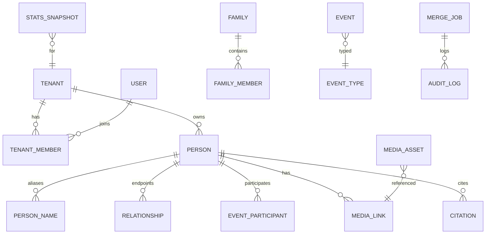

# 数据模型

本文档定义核心业务实体、关键字段与一致性规则。实现时以 **Prisma** 建模（`schema.prisma` 与迁移对齐本文）；命名采用 `snake_case` 表名示例。

## 1. 标识与软删除

- 主键：`uuid` 或 `bigint` 均可；对外暴露建议 UUID。
- 所有业务表：`tenant_id NOT NULL`。
- 软删除：`deleted_at timestamptz NULL`；唯一约束需包含 `deleted_at` 或使用部分唯一索引。
- 时间戳：`created_at`, `updated_at`；审计表另含 `actor_user_id`, `ip`, `payload`。

## 2. 实体关系概览（ER 摘要）

## 3. 表清单（逻辑）

### 3.1 组织与成员

| 表 | 说明 |
|----|------|
| `tenant` | 空间：名称、配置 JSON、状态。 |
| `tenant_member` | `user_id`, `tenant_id`, 角色集合、可选 `branch_root_person_id` 范围。 |
| `invitation` | 邀请 token、过期时间、预分配角色与范围。 |

### 3.2 家谱核心

| 表 | 说明 |
|----|------|
| `person` | 人员主档：性别、存殁、默认显示名、隐私模板引用、合并目标指针（被合并指向存活者）。 |
| `person_external_id` | 导入外部 ID 映射，`(tenant_id, source, external_id)` 唯一。 |
| `person_name` | 别名行：类型（谱名/字/号…）、文本、默认标记。 |
| `life_dates` | 生卒：历法、精度、日期起止、地点 FK（可选拆表）。 |
| `relationship` | `person_a`, `person_b`, `type`, `metadata` JSONB；有序亲子用 `parent_id`,`child_id` 更清晰——实现二选一并文档化。 |
| `family` | 可选家庭单元；`family_member`：`role`（父/母/子）。 |
| `generation_title` | 字辈行：代数、用字、说明。 |

### 3.3 事件与地点

| 表 | 说明 |
|----|------|
| `place` | 规范化地点：层级、别名、坐标。 |
| `event` | 类型、时间表达、地点 FK、描述、可见性。 |
| `event_participant` | 多对多：人物与角色（主角/配偶等）。 |

### 3.4 媒体与来源

| 表 | 说明 |
|----|------|
| `media_asset` | 存储 key、mime、大小、checksum、版权元数据。 |
| `media_link` | 关联 `person` 或 `event`。 |
| `citation` | 来源：类型、标题、URL、页码、摘录、`subject`（多态指向 person/event/relationship）。 |

### 3.5 协作与审计

| 表 | 说明 |
|----|------|
| `change_request` | 修订工单：JSON diff 或关联草稿表、状态、审阅人。 |
| `comment` | 多态关联 + threaded `parent_comment_id`。 |
| `audit_log` | 不可篡改追加：动作类型、资源指针、前后摘要（或 JSON patch）。 |

### 3.6 谱书与版本

| 表 | 说明 |
|----|------|
| `pedigree_snapshot` | 版本元数据：创建时间、创建者、说明。 |
| `pedigree_snapshot_entity` | 大快照可存对象存储指针；小空间可内嵌 JSONB（注意体积）。 |

### 3.7 导入与统计

| 表 | 说明 |
|----|------|
| `import_job`, `import_staging_*` | 任务状态、暂存行、错误报告路径。 |
| `export_job` | 类型、状态、输出 URL、过期时间。 |
| `stats_snapshot` | `tenant_id`, `filter_hash`, `metric_key`, `payload` JSONB, `computed_at`。 |

## 4. 关键一致性规则

1. **有向亲子图**：在同一 `tenant_id` 内，以「父母→子女」有向边构成的图须无环（允许多父的合法情况需在规则中明确：通常检测「生物直系」子图）。
2. **配偶对称**：配偶边可存一条或两条对称记录；必须约定唯一性，避免重复。
3. **合并后引用**：所有外键指向被删人员时，合并任务须重写为存活人员。
4. **删除策略**：人员默认软删除；物理删除仅运维脚本且需离线备份。

## 5. 索引建议（非穷尽）

- `person(tenant_id, deleted_at)`；搜索常用 `(tenant_id, lower(primary_name))`。
- `relationship(tenant_id, parent_id)`、`(tenant_id, child_id)`（若拆亲子列）。
- `event(tenant_id, date_start)` BRIN 或 B-tree（视数据量）。
- `audit_log(tenant_id, created_at DESC)`。
- `stats_snapshot(tenant_id, filter_hash, metric_key)` 唯一。

## 6. 行级安全（可选）

PostgreSQL RLS 可将 `tenant_id = current_setting('app.tenant')` 作为策略；应用层仍须校验权限，RLS 作为纵深防御。

## 7. JSONB 使用边界

- **适合**：扩展属性、导入原始字段、统计快照。
- **不适合**：需要强约束的外键关系（仍用正规列）。
